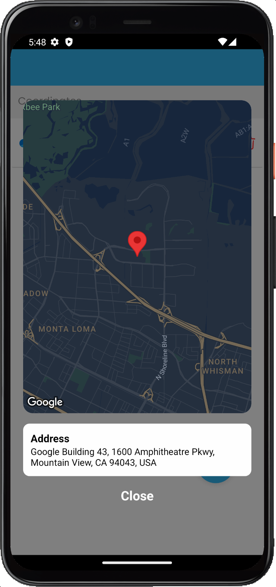

# GPS Recorder

## Overview

GPS Recorder is a React Native application that allows users to record and manage their GPS coordinates. Users can easily add their current GPS location, view a list of recorded coordinates, and delete any coordinates they no longer want. The app utilizes local storage to persist data, ensuring coordinates are available even after the app is closed and reopened.

## Features

- **Add GPS Coordinate:** Tap the floating action button to add the current GPS coordinates (latitude and longitude) to the list.
- **Delete Coordinate:** Remove any coordinate from the list using the associated delete button.
- **Persistent Data:** Recorded coordinates are saved locally, so they persist even after closing the app.
- **Bonus Feature:** Tapping a coordinate opens a popup showing the corresponding address.

## Screenshots

    

## Tech Stack

- **Framework:** React Native
- **State Management:** Redux Toolkit
- **Routing:** React Navigation
- **Storage:** AsyncStorage
- **Geolocation:** React Native Community Geolocation
- **Maps:** React Native Maps

## Installation

To run this application, ensure you have [Node.js](https://nodejs.org/) installed. You can clone this repository and install the dependencies using npm:

```bash
git clone https://github.com/Milan3050/GPSRecorder-ZirohLabs.git
cd GPSRecorder
npm install
```

## Running the App

You can run the application on Android or iOS

### Android

```bash
react-native run-android
```

### iOS

```bash
react-native run-ios
```

if facing any errors, start metro by running

```bash
npm start
```

and build app on XCode

## Usage

- Launch the app. Allow app to use location, and the initial screen will display a floating action button (FAB).
- Tap the FAB to add your current GPS coordinates to the list.
- View the list of coordinates displayed in simple list item format.
- Use the delete button next to any coordinate to remove it from the list.
- Optionally, tap on a coordinate to see its corresponding address.
